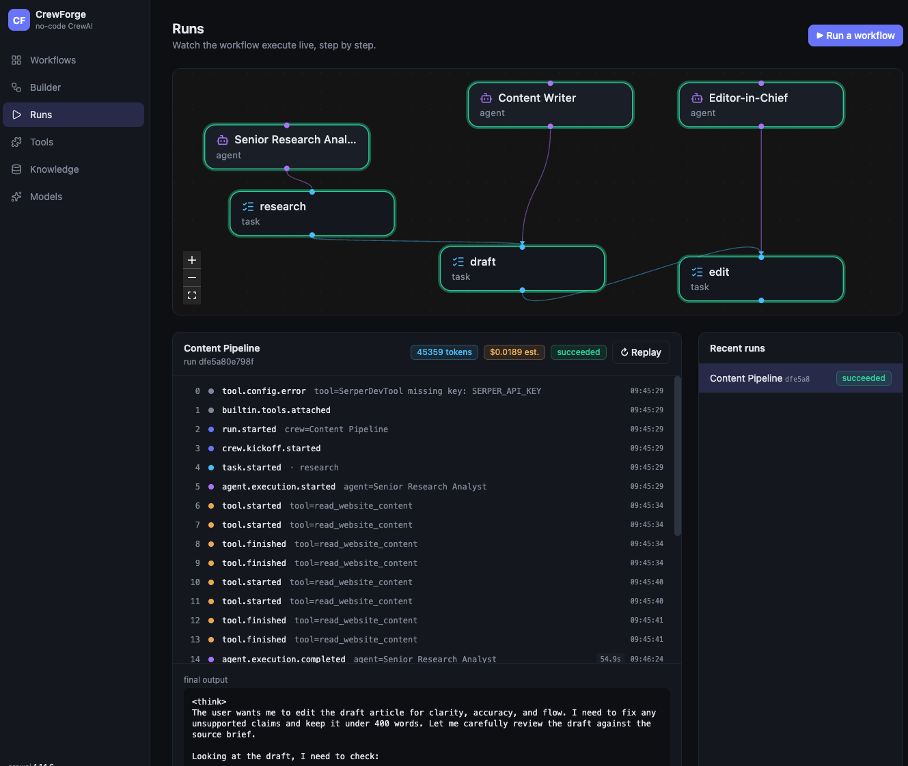
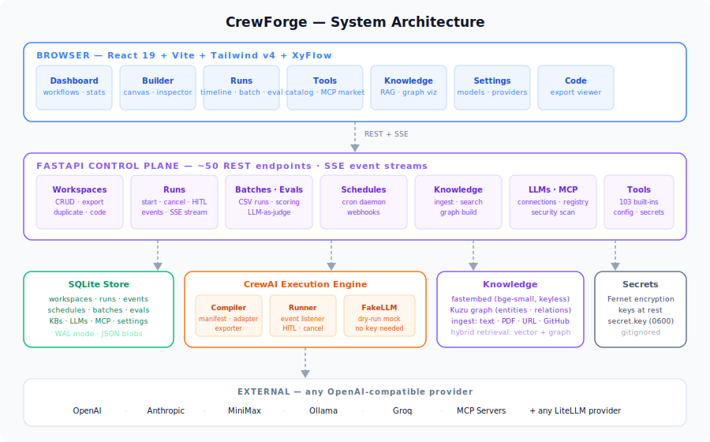
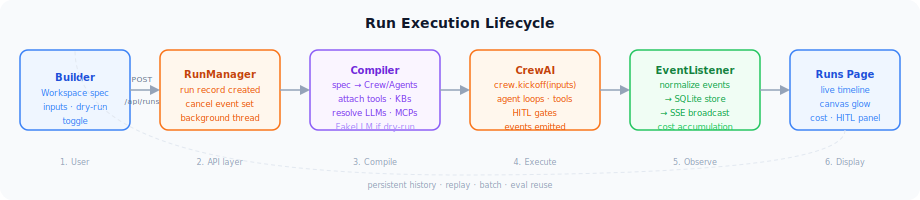

<div align="center">

<h1>⚒️ CrewForge</h1>

<p><strong>The open-source visual studio for <a href="https://github.com/crewAIInc/crewAI">CrewAI</a></strong></p>

<p>Build multi-agent workflows in the browser · Run with live observability · Export clean Python · No lock-in</p>

[](https://github.com/Arturski/CrewForge/actions/workflows/ci.yml)
[](LICENSE)
[](https://www.python.org)
[](https://github.com/crewAIInc/crewAI)
[](CONTRIBUTING.md)

[Quick Start](#-quick-start) · [Features](#-features) · [Architecture](#-architecture) · [Docs](#-documentation) · [Contributing](#-contributing)

</div>

---

<p align="center">
  
</p>

---

## What is CrewForge?

CrewForge is a **self-hosted, no-code studio** that puts a visual front door on [CrewAI](https://github.com/crewAIInc/crewAI). Design a multi-agent crew in the browser, run it live, watch events stream in real-time, then export a clean, idiomatic Python project you own completely.

**No API key required to start** — dry-run mode uses a built-in mock LLM so you can build and explore without touching a provider.

---

## ✨ Features

| | |
|---|---|
| 🎨 **Visual workflow builder** | Drag-and-drop canvas with agent/task nodes, live run glow, and a full inspector |
| 🤖 **103 built-in tools** | Searchable catalog; configure API keys per tool and attach to any agent |
| 🔌 **MCP integrations** | Connect local or remote MCP servers; browse the official registry with security ratings |
| 📚 **Knowledge bases** | Keyless vector RAG (fastembed) + Kuzu knowledge graph; ingest text, files, URLs, GitHub repos |
| 🏃 **Batch runs** | Paste a CSV → one tracked run per row, with aggregate cost and per-row drill-in |
| 📅 **Scheduling + webhooks** | Cron schedules and webhook triggers with per-run input pinning |
| 🧪 **Eval suite** | Define test cases, score with `contains`/`regex`/`equals` or LLM-as-judge |
| 💰 **Cost tracking** | Per-run estimated spend from a curated pricing table; shown on the timeline and dashboard |
| 🛑 **Human-in-the-loop** | Approve, edit output, or request changes mid-run from the Runs page |
| 📤 **Code export** | Download a complete, runnable CrewAI Python project — no vendor lock-in |
| 🔑 **Secrets vault** | Provider keys encrypted at rest (Fernet); never returned to the client |
| 🌐 **Multi-LLM** | Per-workflow and per-agent LLM selection; any OpenAI-compatible provider |
| 🔁 **Replay & duplicate** | Re-run any past run with the same inputs; duplicate workflows in one click |
| ⚡ **Dry-run mode** | Built-in mock LLM; zero network calls; every feature works without a key |

---

## 🚀 Quick Start

**Prerequisites:** Python 3.10+, [uv](https://docs.astral.sh/uv/), Node.js 18+

```bash
git clone https://github.com/Arturski/CrewForge.git
cd CrewForge

uv sync
npm --prefix web install && npm --prefix web run build

uv run crewforge
# → open http://localhost:8765
```

No API key needed. The demo workspace runs immediately in dry-run mode.

### Add a live LLM

1. **Settings → Models → Add connection**
2. Choose a provider preset or enter a custom base URL
3. Paste your API key → **Test connection**
4. In the Builder, toggle **Dry run** off → **Run**

Works with any OpenAI-compatible provider: OpenAI, Anthropic, MiniMax (`api.minimaxi.chat/v1`), Ollama, Groq, Together AI, and hundreds more via LiteLLM.

### Dev mode

```bash
# Terminal 1 — API with hot reload
uv run uvicorn server.app:app --reload --port 8765

# Terminal 2 — Vite dev server
npm --prefix web run dev   # → http://localhost:5180
```

---

## 🏗️ Architecture

<p align="center">
  
</p>

### Run Execution Lifecycle

<p align="center">
  
</p>

**Key design decisions:**

- **Single-process, SQLite-backed** — zero external dependencies; runs on a laptop or a tiny VPS
- **Compatibility engine** — `compiler/manifest.py` introspects the installed `crewai` at startup, building a field manifest that drives the UI dynamically. New CrewAI fields surface as form controls with no code changes.
- **Dry-run everywhere** — `FakeLLM` implements `BaseLLM` and returns a ReAct `Final Answer` so agents complete cleanly. Every feature is exercisable without a key.
- **No lock-in** — the exporter emits a clean, standalone CrewAI project. CrewForge is a tool to build and operate, not a runtime you depend on.

---

## 📖 Documentation

| Doc | Description |
|-----|-------------|
| [Quick Start Guide](docs/QUICKSTART.md) | Step-by-step: first workflow, going live, batch & eval |
| [Architecture](docs/ARCHITECTURE.md) | Module breakdown, data model, design decisions |
| [Deployment](docs/DEPLOYMENT.md) | Self-hosting, reverse proxy, Docker, environment variables |
| [API Reference](docs/API.md) | All REST endpoints with request/response shapes |
| [Contributing](CONTRIBUTING.md) | Dev setup, code conventions, adding new features |
| [Roadmap](ROADMAP.md) | What's shipped and what's next |
| [Security](SECURITY.md) | Threat model, key storage, hardening roadmap |

---

## 🧱 Stack

| Layer | Technology |
|-------|-----------|
| **Backend** | Python 3.10+, FastAPI, SQLite (WAL), uvicorn |
| **AI framework** | CrewAI 1.14+, crewai-tools |
| **Embeddings** | fastembed (`bge-small-en-v1.5`, keyless, local) |
| **Knowledge graph** | Kuzu (embedded, per-KB) |
| **Encryption** | cryptography (Fernet) |
| **Scheduling** | croniter |
| **Frontend** | React 19, Vite, TypeScript, Tailwind v4 |
| **UI components** | Radix UI primitives + shadcn/ui-style system |
| **Canvas** | XyFlow (React Flow) |
| **Icons** | lucide-react |

---

## 🗂️ Project Structure

```
CrewForge/
├── server/                  # FastAPI backend
│   ├── app.py               # All REST + SSE endpoints (~50 routes)
│   ├── store.py             # SQLite: all CRUD (workspaces, runs, KBs, …)
│   ├── runner.py            # Run execution, event capture, HITL, cancel
│   ├── batches.py           # Batch-run driver (CSV → N tracked runs)
│   ├── evals.py             # Eval suite + LLM-as-judge scoring
│   ├── schedules.py         # Cron daemon + webhook trigger handler
│   ├── llms.py              # Multi-LLM connection management
│   ├── mcp.py               # MCP server connect/discover/registry
│   ├── secrets.py           # Fernet encryption at rest
│   ├── pricing.py           # Token cost estimates
│   ├── compiler/
│   │   ├── manifest.py      # CrewAI field introspection → UI manifest
│   │   ├── adapter.py       # Spec → live Crew/Agent/Task + FakeLLM
│   │   ├── exporter.py      # Spec → runnable CrewAI project (zip)
│   │   └── tools.py         # 103 built-in crewai_tools catalog
│   └── knowledge/
│       ├── kb.py            # KB CRUD + background ingest orchestration
│       ├── vector.py        # fastembed chunking + cosine search
│       ├── graph.py         # Kuzu graph: entities, relations, hybrid retrieval
│       ├── extract.py       # LLM entity/relation extraction
│       ├── web.py           # URL ingest + same-host crawl
│       └── github.py        # GitHub repo ingest via tarball
├── web/                     # React 19 SPA
│   └── src/
│       ├── pages/           # Dashboard, Builder, Runs, Tools, Knowledge, Settings, Code
│       └── components/      # CrewCanvas, EventTimeline, ui.tsx, Sidebar
├── tests/                   # 52 pytest tests (no network required)
├── docs/                    # This documentation + architecture diagrams
└── spikes/                  # Architecture proof-of-concept scripts
```

---

## 🧪 Quality Gates

```bash
# 52 tests, ~5 seconds, no network, no API key
uv run --extra dev pytest -q

# Lint
uv run --extra dev ruff check server tests

# TypeScript strict + production build
npm --prefix web run build
```

All tests pass green. Zero browser console errors (verified with Playwright across all pages + mobile viewport).

---

## 🤝 Contributing

Contributions are very welcome — see [CONTRIBUTING.md](CONTRIBUTING.md) for the dev setup, code conventions, and how to add support for new CrewAI features.

```bash
git clone https://github.com/Arturski/CrewForge.git && cd CrewForge
uv sync && npm --prefix web install
uv run --extra dev pytest -q      # all green
npm --prefix web run build        # tsc strict pass
```

---

## 🗺️ Roadmap

See [ROADMAP.md](ROADMAP.md) for what's shipped and what's coming. Highlights on deck:

- **Eval history & trend** — pass-rate over time per workflow
- **CrewAI Flows** — visual multi-crew orchestration with `@router`/`@listen`
- **Run analytics** — cost, token, and success-rate dashboards
- **Workspace versioning** — snapshot, diff, rollback
- **Containerized workers** — durable, crash-safe execution

---

## 📄 License

[Apache-2.0](LICENSE) — free to use, modify, and distribute.
